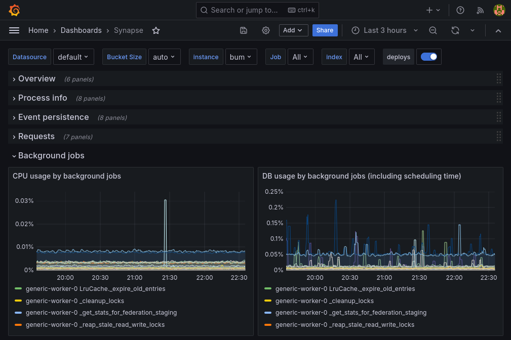
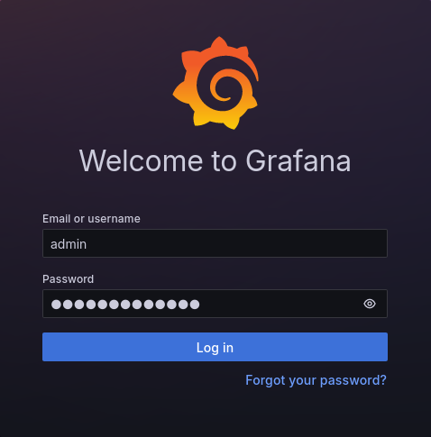
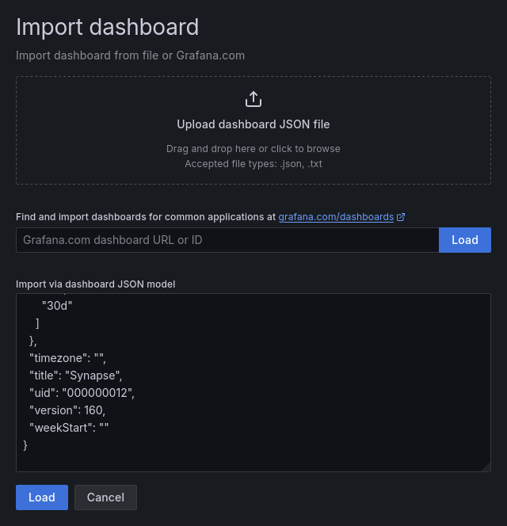

# Monitoring mit Grafana

Für die Echtzeitüberwachung und Visualisierung des BundesMessengers können
[Prometheus] und [Grafana] verwendet werden. Diese sind nicht Teil des
BundesMessenger Helm-Charts, aber einfach anzubinden. Im Folgenden wird die
Einrichtung des [Kube Prometheus Stack][kube-prometheus-stack] beschrieben, um
die Überwachung einer bestehenden BundesMessenger-Instanz zu ermöglichen.



[Prometheus]: <https://prometheus.io/>
[Grafana]: <https://grafana.com/oss/grafana/>
[kube-prometheus-stack]:
    <https://github.com/prometheus-community/helm-charts/tree/main/charts/kube-prometheus-stack>

## Installation

🛈 **Info** – Einige Anbieter haben Prometheus/Grafana bereits vorinstalliert,
oder bieten eigene Wege der Einrichtung an. Diese sind üblicherweise der hier
beschriebenen Methode vorzuziehen, womit dann die Installation von
kube-prometheus-stack entfällt.

Das [kube-prometheus-stack] Chart bietet ein komplettes Deployment und die
Integration von Prometheus und Grafana. Zur Installation kann der folgende
Befehl verwendet werden:

```sh
helm upgrade --install kube-prometheus-stack kube-prometheus-stack \
  --repo https://prometheus-community.github.io/helm-charts \
  --namespace monitoring --create-namespace
```

## Anbindung des BundesMessengers

Soll der BundesMessenger Daten an Prometheus liefern, muss die `monitoring`
Konfiguration des BundesMessengers angepasst werden. Dazu muss
`monitoring.enabled: true` und ein passendes Label zur Referenz auf Prometheus
gesetzt sein. Dieses Label findet man mit dem folgenden Befehl:

```sh
kubectl get Prometheus --all-namespaces -o jsonpath='{.items[*].spec.podMonitorSelector.matchLabels}'
```

Das gefundene Label ist beispielsweise `release: kube-prometheus-stack`, womit
sich folgende Monitoring-Konfiguration ergibt:

```yaml
monitoring:
  enabled: true
  labels:
    # Beispielausgabe des vorherigen Befehls
    release: kube-prometheus-stack
```

Nach einem Upgrade des BundesMessenger-Charts mit dieser Konfiguration ist die
Installation abgeschlossen.

## Zugriff auf Grafana

Grafana ist ein Visualisierungswerkzeug für Echtzeitdaten mit einer
Web-Oberfläche. Um Zugriff auf Grafana zu bekommen, kann die
Portweiterleitungsfunktion von Kubernetes für den Grafana-Pod verwendet werden:

```sh
kubectl --namespace monitoring port-forward $(kubectl --namespace=monitoring get pods -o=name -l app.kubernetes.io/name=grafana) 3000
```

Nach Ausführen des Befehls sollte unter <http://localhost:3000> die
Grafana-Benutzeroberfläche erreichbar sein. Das Anmelden erfolgt mit den für
`kube-prometheus-stack` hinterlegten Anmeldedaten. Standardmäßig ist dies der
Benutzer `admin` mit dem Passwort `prom-operator`.



## Grafana Dashboards

Um die Echtzeitdaten der verschiedenen BundesMessenger-Komponenten zu
visualisieren, müssen in Grafana *Dashboards* angelegt werden. Für manche
Komponenten existieren bereits vorgefertigte Dashboard-Beschreibungen:

- Synapse  
  https://raw.githubusercontent.com/element-hq/synapse/master/contrib/grafana/synapse.json
- Sygnal  
  https://raw.githubusercontent.com/matrix-org/sygnal/main/contrib/grafana/Sygnal.json

Beim Importieren eines Dashboards nach Grafana kann der Inhalt der JSON-Datei
kopiert und in der Weboberfläche eingefügt werden. Nach Bestätigung und
Auswählen der Prometheus-Datenquelle ist das neue Dashboard direkt verfügbar.


