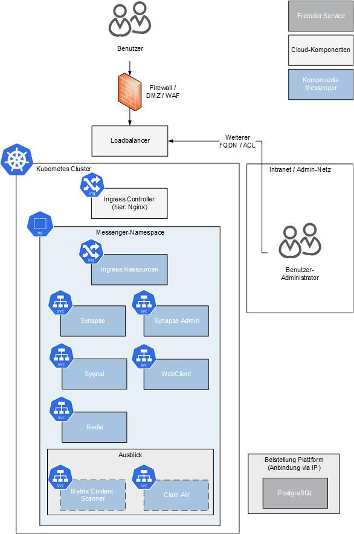

# Installation des BundesMessengers

:pushpin: Alle möglichen Konfigurationswerte bzw. Parameter für das Helm Chart
sind in der [`values.yaml`](../values.yaml) aufgeführt.

Weiterführende Links:

- [Mindestkonfiguration von Parametern](./requirements-poc.md#requirements-für-die-konfiguration)
- [Kurzanleitung zur Installation einer Testumgebung](./installation-testumgebung.md)
- [Hinweise zur Nutzung mit ArgoCD](./argocd.md)

:pushpin: Getestet wird das Helm Chart auf einer Kubernetes-Infrastruktur mit einem
[4-Node-Cluster](./requirements-poc.md#maschinengröße) auf Basis von vanilla
Kubernetes.

Im weiteren Verlauf der Anleitung wird die Installation mit dem Befehl

```sh
helm install bundesmessenger bundesmessenger/bundesmessenger
```

und der direkten Angabe der Parameter mit dem automatischen Download aus dem
Chart Museum Repository beschrieben.
Mit dem Repository (Chart Museum) kann sich mit dem folgenden Befehl verbunden werden:

```console
helm repo add bundesmessenger https://gitlab.opencode.de/api/v4/projects/560/packages/helm/stable
```

Alternativ steht das Helm-Chart auch in der OCI-Registry zur Verfügung.

```console
helm show chart oci://registry.opencode.de/bwi/bundesmessenger/backend/helm-chart/bundesmessenger
```

Weiterhin kann die Installation auch durch den manuellen Download des
Helm Charts und das Anpassen der Parameter in der `values.yaml` erfolgen.
Eine Installation würde dann mit folgendem Beispiel-Befehl erfolgen:

```console
helm install bundesmessenger . -f values.yaml
```

Optional mit dem Erstellen eines neuen Namespace `bum`:

- lokales Verzeichnis

  ```console
  helm install bundesmessenger . \
    -f values.yaml --create-namespace -n bum
  ```

- Chart Museum Repository

  ```console
  helm install bundesmessenger bundesmessenger/bundesmessenger \
    -f values.yaml --create-namespace -n bum
  ```

- OCI-Registry

  ```console
  helm install bundesmessenger oci://registry.opencode.de/bwi/bundesmessenger/backend/helm-chart/bundesmessenger \
    -f values.yaml --create-namespace -n bum
  ```

## Infrastruktur

Das Helm Chart rollt die im Bild blau dargestellten Komponenten aus.



## Voraussetzungen

- Bereitstellen der Basis-Images in eigener Registry oder Nutzung von OpenCoDE
  - Empfehlung: Spiegelung der Basis- und Service-Images aus der OpenCoDE Registry
- Anpassung der [`values.yaml`](../values.yaml) zur Nutzung der richtigen Images
  und Registry
  - :pushpin: Informationen zur Bereitstellung der
  [Container-Basisimages](./requirements-poc.md#container-basisimages)
  und [BundesMessenger Container Registry](https://gitlab.opencode.de/bwi/bundesmessenger/backend/container-images/)
- Bereitstellen des Helm Charts im eigenen Repository (`helm repo add`). In den
  Beispielen `bundesmessenger`. Alternativ die Installation des Helm Charts aus
  dem Dateisystem (z.B. `./bundesmessenger/`) oder der OpenCoDE OCI-Registry.
- ([Sub-)Domains mit dazugehörigen TLS-Zertifikaten](./requirements-poc.md#hostnamendns)
  ([Sicherheitshinweis](https://github.com/element-hq/synapse/blob/develop/README.rst#security-note))
  - Eine (Sub-)Domain für den Applikationsserver z.B.: `matrix.example.com`
  (Parameter `serverName` bzw. `publicServerName`)
  - Eine (Sub-)Domain für den WebClient z.B. `app.example.com`, besser `app.example.net`
  - Eine (Sub-)Domain für den Call Client
  - Eine (Sub-)Domain für die Administrationsoberfläche um den Zugriff zu separieren
  bzw. die Admin-Schnittstelle vor öffentlichen Zugriff zu schützen (Parameter `adminPortal.uri`)
- [Kubernetes](https://kubernetes.io/) 1.25+
- [Helm](https://helm.sh/) 3.11+
- Ingress Controller (NginX) im Cluster installiert
- vorgelagerte Loadbalancer und vorkonfigurierte Firewalls, um den Service
  in vollem Umfang zu nutzen
- *Optional: Storage muss `PersistentVolumeClaims` zulassen und konfiguriert
  haben (von Vorteil für die Datenbank und Media)*
- Zugriff auf vorhandenen [PostgreSQL](https://www.postgresql.org/)
  Server (konform zur DVS)
  - Datenbank für Synapse (z. Bsp. `synapse_db`) mit einem Benutzer (z. Bsp.`synapse`).
  - Datenbank für MAS (z. Bsp.`mas_synapse`) mit einem Benutzer (z. Bsp.`mas`).
  - Server muss aus dem k8s-Namespace erreichbar sein
  - :pushpin: **Hinweis:** Collation und cType müssen auf `C` (für die Synapse Datenbank)
  gesetzt sein. Siehe [Postgresql-Datenbank](./requirements-poc.md#postgresql-datenbank)
- *Optional: ein `existingClaim` (persistent volume claim) mit dem Namen
  `matrix-synapse` (empfohlen 10 GB) für den Media-Worker als Speicher.*

:pushpin: **Hinweis:** Sollte die `storageClass` `nfs-client` nicht existent
sein, muss diese erstellt oder mit dem folgenden Parameter gesetzt werden:

```console
helm install bundesmessenger bundesmessenger/bundesmessenger --set persistence.storageClass=STORAGECLASS
```

Alternativ können auch dynamisch erstellte
PersistentVolumeClaim (PVC) genutzt werden, wenn eine entsprechende
[StorageClass](https://kubernetes.io/docs/concepts/storage/storage-classes/)
mit CSI-Volume-Plug-ins
[(**C**ontainer **S**torage **I**nterface](https://kubernetes.io/docs/concepts/storage/volumes/#csi))
konfiguriert wurde.

:pushpin: Matrix benötigt valide TLS-Zertifikate und HTTPS-Verbindungen um voll
funktionsfähig zu sein. Das Helm Chart stellt die Infrastruktur auf Basis
eines `http`-Listeners bereit. Details hierzu sind in der
[Dokumentation zu den TLS-Zertifikaten](./requirements-poc.md#ssl-zertifikate)
beschrieben.

## Option 1: Domain entspricht den Benutzernamen (ohne Delegation)

Für eine möglichst einfache Matrix-Installation, können Sie Ihre
Synapse-Installation auf der gewünschten Domain für Ihre MXIDs ausführen. Eine
[Delegation](./delegation.md) ist nicht notwendig.

**Die Server-Adresse `example.com` entspricht den Benutzernamen
`@localpart:example.com`.**

```console
helm install bundesmessenger bundesmessenger/bundesmessenger \
  --set serverName=example.com \
  --set wellknown.enabled=true
```

Es wird bereitgestellt:

- Synapse für Client- und Föderations-Verbindungen auf `example.com/_matrix`
- Nginx Server für well-known-Anfragen auf `example.com/.well-known/matrix/server`

Es ist auch möglich, Synapse auf einer Subdomain (`matrix.example.com`) laufen
zu lassen, wobei diese dann Teil Ihrer MXIDs wird:
(`@localpart:matrix.example.com` in folgenden Beispiel)

```console
helm install bundesmessenger bundesmessenger/bundesmessenger \
  --set serverName=matrix.example.com \
  --set wellknown.enabled=true
```

## Option 2: Domain entspricht nicht den Benutzernamen (mit Delegation)

Für den Fall, Sie besitzen die Domain `example.com` und Sie wollen
Benutzernamen in der Form `@localpart:example.com`, aber dennoch den Server
unter der Domain `matrix.example.com` laufen lassen, kann dies durch
[Delegation](./delegation.md) erreicht werden. Hierfür gibt es zwei Möglichkeiten:
DNS (:warning: nicht empfohlen) oder well-known.

**Die Server-Adresse `matrix.example.com` ist unabhängig von den Benutzernamen
`@localpart:example.com`.**

- Für die **well-known-Variante** erfolgt die Installation wie folgt:

  ```console
  helm install bundesmessenger bundesmessenger/bundesmessenger \
    --set serverName=example.com \
    --set publicServerName=matrix.example.com \
    --set wellknown.enabled=true
  ```

  Es wird bereitgestellt:

  - Synapse für Client- und Föderations-Verbindungen auf `matrix.example.com/_matrix`
  - Nginx Server für well-known-Anfragen auf `example.com/.well-known/matrix/server`

  :pushpin: Sie benötigen zusätzlich zum Zertifikat für `matrix.example.com`
  ein weiteres für `example.com`.

  :pushpin: Falls die Domain `example.com` nicht in diesem K8s Cluster gehostet
  wird, kann der well-known Eintrag auch manuell auf dem Server `example.com`
  erstellt und gehostet werden.

- Für die **DNS-Variante** installieren Sie den Messenger-Service wie folgt:

  ```console
  helm install bundesmessenger bundesmessenger/bundesmessenger \
    --set serverName=example.com \
    --set publicServerName=matrix.example.com
  ```

  Es wird bereitgestellt:

  - Synapse für Client- und Föderations-Verbindungen auf `matrix.example.com/_matrix`

   Zusätzlich wird für die Föderation der DNS SRV-Record benötigt, siehe der
   [Anleitung zu Delegation](./delegation.md).

| :pushpin: Weitere Setups, Erweiterungen und Services wie Loadbalancer und TLS-Listener werden noch folgen. |
| --- |

## Verbindung prüfen

Nachdem  die Anwendung installiert wurde, ist diese über
folgende URL mit Hilfe des Browsers erreichbar:

`http://matrix.example.com/_matrix/client/versions`

Der Hostname `matrix.example.com` entspricht dem angegebenen `serverName`
bzw. dem `publicServerName`.

Beispielausgabe

```json
{
   "versions":[
      "r0.0.1",
      "r0.1.0",
      "r0.2.0",
      "r0.3.0",
      "r0.4.0",
      "r0.5.0",
      "r0.6.0",
      "r0.6.1",
      "v1.1",
      "v1.2",
      "v1.3",
      "v1.4"
   ]
}
```

Die Ausgabe der Abfrage wird im
[Matrix Spec](https://spec.matrix.org/latest/client-server-api/#get_matrixclientversions)
beschrieben.

## Erster Benutzer

Nach der Installation sind in der Umgebung keine Benutzer vorhanden.

- [Dokumentation um den ersten Benutzer anzulegen](./nutzerverwaltung.md)

## Upgrade

Ein Upgrade oder Anpassen von Konfigurationswerten erfolgt mit Hilfe von
`helm upgrade`.

Upgrade mit Angabe der Parameter in der Konsole:

```console
helm upgrade bundesmessenger bundesmessenger/bundesmessenger \
--set serverName=example.com \
--set publicServerName=matrix.example.com
```

Upgrade mit Angabe der Parameter in der `values.yaml`:

- lokales Verzeichnis

  ```console
  helm upgrade bundesmessenger . \
    -f values.yaml --create-namespace -n bum
  ```

- Chart Museum Repository

  ```console
  helm upgrade bundesmessenger bundesmessenger/bundesmessenger \
    -f values.yaml --create-namespace -n bum
  ```

- OCI-Registry

  ```console
  helm upgrade bundesmessenger oci://registry.opencode.de/bwi/bundesmessenger/backend/helm-chart/bundesmessenger \
    -f values.yaml --create-namespace -n bum
  ```

## Weiterführende Dokumentation

Eine Anweisung für die Installation einer Umgebung finden Sie hier, so wie
auch Hinweise zu den einzelnen zusätzlichen Diensten:

- [PoC Requirements](./requirements-poc.md)
- [Benutzerverwaltung](./nutzerverwaltung.md)
- [BundesMessenger WebClient](./webclient.md)
- [Synapse Admin](./synapse-admin.md)
- [Sygnal (Push-Service)](./sygnal-push.md)
- [Huddle Meetings / Call](./huddle-meetings.md)
- [LiveKit Server / WebRTC Server](./livekit-server.md)
- [Synapse Module](./synapse-modules.md)
- [Matrix-Authentication-Service](./matrix-authentication-service.md)
- [Monitoring mit Grafana](./monitoring-mit-grafana.md)
- [Föderation](./federation.md)

## Kontakt und Austausch

Für Fragen zur Anwendung des Helm-Charts, Konfiguration, Deployment und BundesMessenger
haben wir einen [Matrix Raum](https://matrix.to/#/#opencodebum:matrix.org) erstellt.

<!-- markdownlint-disable -->
<div align="center">
  
</div>
<!-- markdownlint-enable -->

Kein Matrix Client zur Hand, dann auch gerne über unser [Email Postfach](mailto:bundesmessenger@bwi.de).

Wir freuen uns auf den Austausch.

## Externe Quellen und Referenzen

- [Helm Install Guide](https://helm.sh/docs/intro/install/)
- [Kubernetes Ingress](https://kubernetes.io/docs/concepts/services-networking/ingress/)
