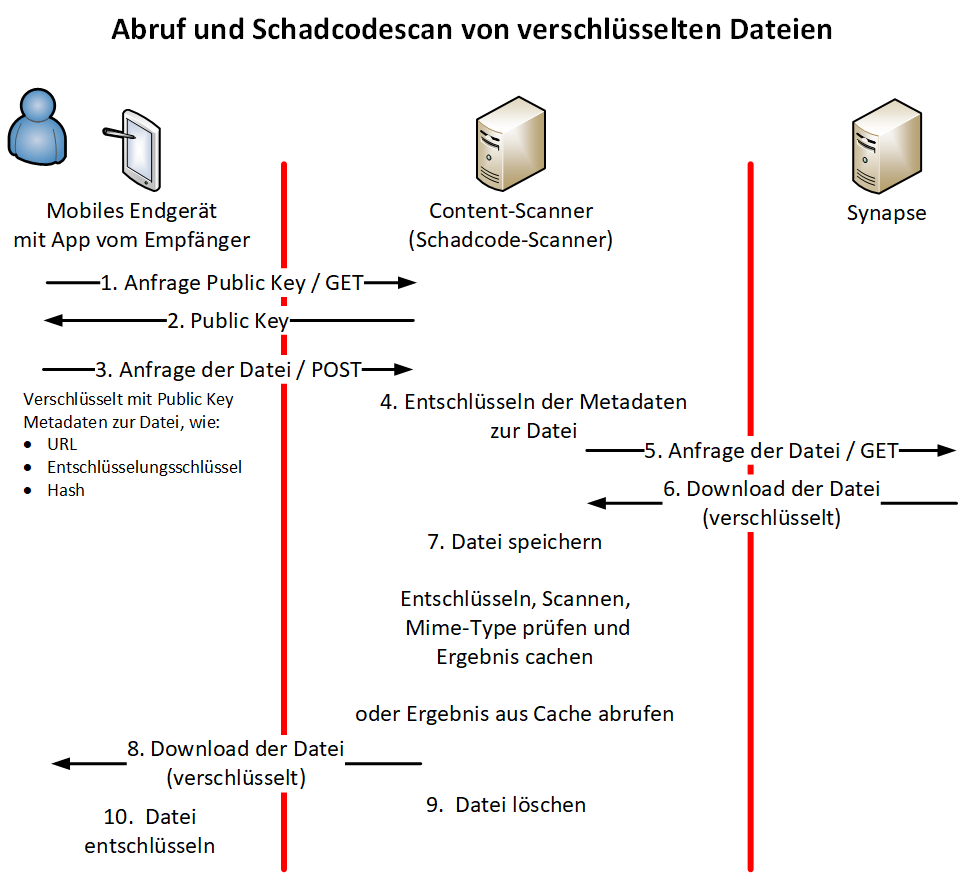

# Matrix-Content-Scanner und Schadcodescanner

Der BundesMessenger stellt für die Suche nach Schadsoftware die Möglichkeit
bereit, den Matrix-Content-Scanner in Zusammenarbeit mit dem
Schadcodescanner-Modul zu benutzen.

Beim Herunterladen einer Mediendatei teilen die BuM-Apps den Schlüssel zum Lesen
der Datei mit dem Matrix-Content-Scanner. Dieser läd die Datei aus dem
Media-Repo, entschlüsselt sie und übergibt sie dem Schadcodescanner zur
eigentlichen Überprüfung. Alternativ kann statt dem mitgelieferten
Schadcodescanner-Modul auch eine beliebige eigene Antivirenlösung verwendet
werden.



## Matrix-Content-Scanner vs. Schadcodescanner

Der Matrix-Content-Scanner ist ein Modul im BundesMessenger, das zur Analyse
und Prüfung von hochgeladenen Dateien dient.

Mit dem `contentscanner` können Dateien die im Chat hochgeladen wurden,
während des Downloads gegen einen Schadcodescanner geprüft werden.

Im HelmChart wird für den `schadcodescanner` als Antivirenlösung `ClamAV` genutzt,
jedoch kann auch eine andere Antivirenlösung angesprochen werden.

### Aktivierung des Matrix-Content-Scanner

| :warning: Wichtig: Durch das Aktivieren des Content-Scanners wird die Ende-zu-Ende-Verschlüsselung für alle im BundesMessenger versendeten Dateien aufgebrochen. |
| --- |

Der `contentscanner` kann über die Helm-Werte (`values.yaml`) gesteuert werden:

```yaml
contentscanner:
  enabled: true  # Setzt den Contentscanner aktiv
```

**Hinweis:** Eine Deaktivierung des Contentscanners ist nicht empfohlen,
da er für mobile Clients aktuell immer benötigt wird.

### Nutzung eines eigenen Scanner-Skripts

Es ist möglich, ein eigenes Scan-Skript zu hinterlegen, um ein alternative
Antivirenlösung anzusprechen. Dabei sollte das Skript so angepasst werden,
dass es die gewünschte Engine über `c-icap` oder eine andere Schnittstelle anspricht:

```yaml
contentscanner:
  scanScript: "/opt/custom/script.sh"  # Eigene Scan-Logik für alternative AV-Engines
```

Das Skript `/opt/custom/script.sh` sollte die zu verwendende Antivirenlösung
definieren, beispielsweise durch Anbindung mit `c-icap` oder an einen anderen Scanner-Dienst.

Zusätzlich muss das eigene Skript dem Container zur Verfügung gestellt werden.
Dies erfolgt über die `extraVolumes` und `extraVolumeMounts` Konfiguration:

```yaml
# -- (list) Zusätzliche in den Matrix-Content-Scanner zu mountende Datenträger (Volumes)
extraVolumes:
  - name: custom-scanscript
    configMap:
      name: custom-scanscript
      defaultMode: 0755
      items:
      - key: script.sh
        path: script.sh

# -- (list) Zusätzliche in den Matrix-Content-Scanner zu mountende Pfade (Volumes)
extraVolumeMounts:
  - name: custom-scanscript
    mountPath: /opt/custom/
    subMountPath: script.sh
    readOnly: true
```

**Wichtig:** Das Hinzufügen des Skripts per `ConfigMap` zum Kubernetes-Cluster
muss der Nutzer zuvor selbstständig übernehmen.

### Deaktivierung des AntiVirus-Scans

Falls der Antivirenscan vollständig deaktiviert werden soll, muss der
`contentscanner` das Bypass-Skript verwenden,
und der Schadcodescanner muss deaktiviert sein:

```yaml
contentscanner:
  scanScript: "/opt/scanner_bypass.sh"  # Umgehung des AV-Scans

schadcodescanner:
  enabled: false
```

## ClamAV Mirror-Einstellungen

Falls ClamAV weiterhin genutzt wird, sollte ein privater Mirror für `freshclam`
gesetzt werden, um Updates schneller und stabiler zu beziehen:

```yaml
schadcodescanner:
  freshclam:
    mirror:
      - mein.mirror.local:8000  # Privater Mirror für ClamAV-Updates
```

## Zusammenfassung

- `contentscanner.enabled` steuert die Aktivierung des Scanners
(sollte nicht deaktiviert werden).
- `scanScript` kann genutzt werden, um ein alternative Antivirenlösung über
`c-icap` oder andere Schnittstellen anzusprechen.
- Falls der Scan deaktiviert werden soll, muss `scanScript: "/opt/scanner_bypass.sh"`
gesetzt und `schadcodescanner.enabled: false` sein.
- Das eigene Scan-Skript muss über `ConfigMap` und `extraVolumes`/`extraVolumeMounts`
bereitgestellt werden.
- ClamAV sollte idealerweise einen privaten Mirror für Updates nutzen.

Diese Einstellungen ermöglichen eine flexible Anpassung des Schadcodescanners
für den BundesMessenger.
