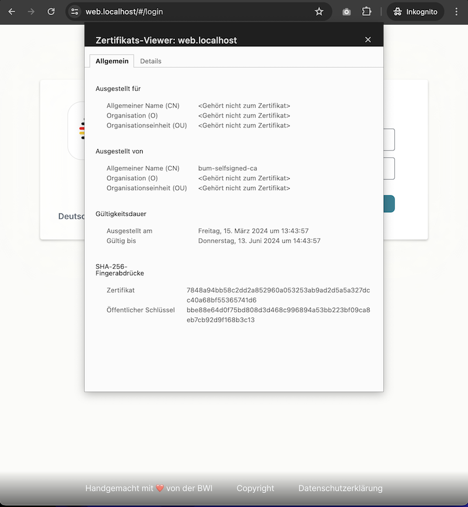

# Localhost Selfsigned Certmanager Setup

> :warning: **Wichtiger Hinweis:** Self-Signed-Zertifikate sind ausschließlich
für lokale Tests vorgesehen und können nicht in einer Produktionsumgebung
eingesetzt werden!

:pushpin: Für Release im `bum` Namespace ggf. anpassen.

**Schritt-für-Schritt-Anleitung von**
[Self-Signed Zertifikaten](https://cert-manager.io/docs/configuration/selfsigned/).



## 0. Installation des Cert Managers

Folgender Befehl installiert den Cert Manager:

```sh
helm upgrade --install cert-manager cert-manager \
  --namespace cert-manager --create-namespace \
  --repo https://charts.jetstack.io \
  --set installCRDs=true
```

## 1. Erstellung der erforderlichen Ressourcen und Helm-Dateien

Zur Erstellung der Self-Signed-Ressourcen-YAMLs müssen die Inhalte der folgenden
zwei Dateien kopiert und ggf. angepasst werden. Diese Dateien können z.B in
einem Ordner `certs` im Projekt-Root-Verzeichnis abgelegt werden:
Das folgende YAML erstellt einen selbstsignierten Issuer (Aussteller), stellt ein
Stammzertifikat (root-certificate) aus und verwendet dieses als CA-Issuer.

- Erstelle das Verzeichnis `certs` im Projekt-Root.

- `certs/bum-selfsigned.yaml` (Kubernetes-Ressourcen)

```yaml
# certs/bum-selfsigned.yaml
---
apiVersion: cert-manager.io/v1
kind: ClusterIssuer
metadata:
  name: selfsigned-issuer
spec:
  selfSigned: {}

---
apiVersion: cert-manager.io/v1
kind: Certificate
metadata:
  name: bum-selfsigned-ca
  namespace: bum
spec:
  isCA: true
  commonName: bum-selfsigned-ca
  secretName: root-secret
  privateKey:
    algorithm: ECDSA
    size: 256
  issuerRef:
    name: selfsigned-issuer
    kind: ClusterIssuer
    group: cert-manager.io

---
apiVersion: cert-manager.io/v1
kind: Issuer
metadata:
  name: bum-ca-issuer
  namespace: bum
spec:
  ca:
    secretName: root-secret

---
apiVersion: cert-manager.io/v1
kind: Certificate
metadata:
  name: bum-ca-cert
  namespace: bum
spec:
  secretName: bum-ca-cert-secret
  dnsNames:
    - web.localhost
    - matrix.localhost
    - server.localhost
  issuerRef:
    name: bum-ca-issuer
    kind: Issuer
    group: cert-manager.io
```

- `certs/bum-tls.yaml` (Helm-Werte)

```yaml
# certs/bum-tls.yaml
---
ingress:
  tls:
    - hosts:
        - web.localhost
        - server.localhost
        - matrix.localhost
      secretName: bum-ca-cert-secret
  annotations:
    cert-manager.io/cluster-issuer: selfsigned-issuer
```

## 2. Einrichtung von Cluster Issuer und Zertifikaten

Erstellung von Cert Manager Cluster ClusterIssuer, Root-Secret, Namespace-Issuer
und Zertifikat für DNS-Namen:

```yaml
  dnsNames:
    - web.localhost
    - matrix.localhost
    - server.localhost
```

_(Wenn andere DNS-Namen verwendet werden, müssen diese in bum-selfsigned.yaml und
bum-tls.yaml angepasst werden.)_

Anwendung der Konfiguration mit folgendem Befehl:

```sh
kubectl apply -f certs/bum-selfsigned.yaml
```

## 3. Export des CA-Zertifikatsdann

Ausführung des folgenden Befehls zum Exportieren des CA-Zertifikats:

```sh
kubectl get secret root-secret -n bum -o jsonpath="{.data['tls\.crt']}" | base64 --decode > certs/bum-selfsigned-ca.crt
```

Das exportierte `certs/bum-selfsigned-ca.crt` muss dem Browser oder der
System-Keychain hinzugefügt werden.

**Für Linux:**

```sh
sudo cp certs/bum-selfsigned-ca.crt /usr/local/share/ca-certificates/
sudo update-ca-certificates
```

**Für Mac:**

```sh
sudo security add-trusted-cert -d -r trustRoot -k /Library/Keychains/System.keychain certs/bum-selfsigned-ca.crt
```

**Für Windows:**

- [Importieren nach Chrome und Firefox](https://www.techrepublic.com/article/how-to-add-a-trusted-certificate-authority-certificate-to-chrome-and-firefox/)
- [Importieren nach Edge](https://www.client-authentifizierung.de/de/browser/edge/edge-unter-windows)
- [Beschreibung von Microsoft](https://learn.microsoft.com/de-de/windows-hardware/drivers/install/trusted-root-certification-authorities-certificate-store).

## 4. TLS Ingress Annotation und Redeployment

Redeployment des Helmcharts mit `-f certs/bum-tls.yaml`.
Hinzufügen der notwendigen TLS-Hosts und -Secrets zum Ingress,
wie die Annotation selfsigned-issuer.

```sh
helm upgrade RELEASENAME . --namespace bum --create-namespace --install -f YOUR-VALUES.yaml -f certs/bum-tls.yaml
```

## 5. Browser-Neustart

Nach einem Neustart des Browsers sind die Endpunkte dauerhaft über HTTPS
erreichbar: `https://web.localhost`

> :warning: Bitte beachten:
_Selfsigned-Zertifikate sind standardmäßig nur 90 Tage gültig._
Nach Ablauf dieser Frist müssen sie ggf. erneuert werden.
Weitere Informationen zur Erneuerung von Zertifikaten finden sich in der [Cert-Manager-Dokumentation](https://cert-manager.io/docs/usage/certificate/#issuance-triggers).
